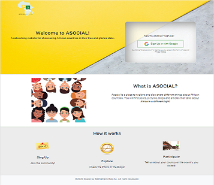
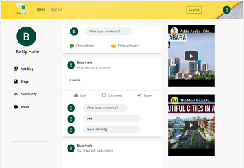

# Asocial

# Deployed link:-
(https://asocial-mysocial.herokuapp.com/)

# Description
Asocial is a networking website where people share useful information about Africa.  The stories of African countries are not told the way developed countries tell their stories, controling their own narratives and dictating what the world should really know about them. 

The goal is when you google for african countries, Asocial is the first website you will find. Within you will be able to have wealth of informations in the form of blogs, vlogs, posts and much more. 

The africa you will never see on TV!! FROM People who has first hand experience sharing their stories.

#

 
#
  

# Table of Contents

* [Installation](#installation)

* [Usage](#usage)

* [License](#license)

* [Contributing](#contributing)

* [Tests](#tests)

* [Questions](#questions)

# Installation

Dependencies must be installed to run the application properly: 
* npm install 
* create account with firebase and pusher. Refer to the .env. example file.

# Tecnologies Used

FRONTEND
* bootstrap
* react
* react-dom
* react-router-dom
* react-scripts
* web-vitals
* Neumorphism.io
* dotenv
* firebase
* pusher-js

BACKEND

* axios
* body-parser
* cors
* dotenv
* express
* gridfs-stream
* if-env
* mongoose
* multer
* multer-gridfs-storage
* nodemon
* path
* pusher
* concurrently
  

# Usage
As a person who likes to travel, I WANT to get information about the country I am planning to visit.  
SO THAT I  can be prepared and have a positive expectation.

As person who likes to share my experiences, I WANT the world to know the beauty of A country!  
SO THAT everyone that wants to visit the country can have their own beautiful experience and share.

# License

This project is license under the **MIT** license.

# Contributing

* Contributor: Bethlehem Balcha

# Tests

To run tests, you need to run the following command:

# Questions

* If you have any questions:-

* GitHub username: @bettycode

* Email: betty.haile.us@gmail.com
